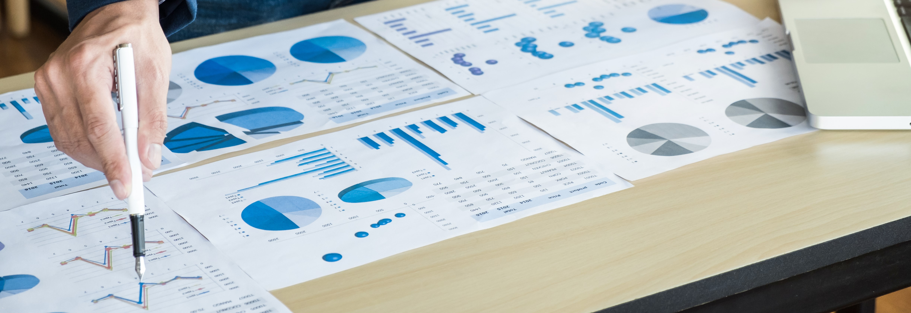
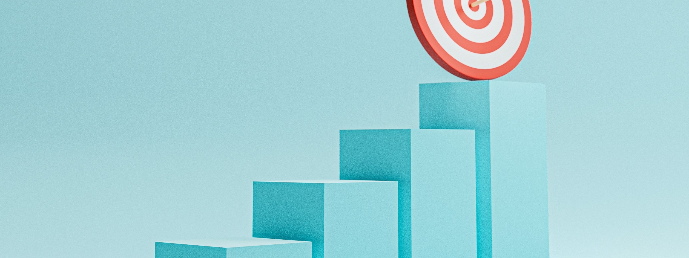
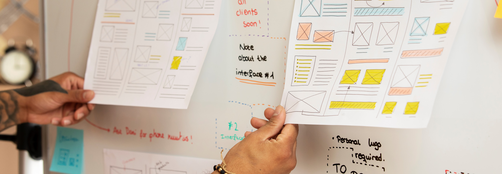
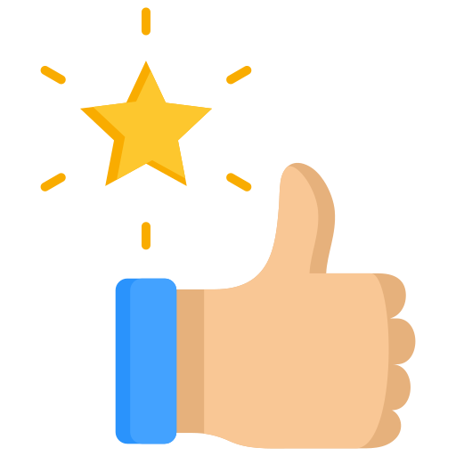

#  **Roadmap's Criteria | IEEE Mansoura Computer Society Chapter (2023)**

A Roadmap is a valuable tool for students as it aims for setting a specific and well-organized plan to study a specific track. Creating a roadmap can be complex, as it involves balancing priorities, identifying obstacles, and aligning with organizational goals.  

The template includes standardized sections and elements that can be customized for the specific track's needs. By using a template, organizations save time and ensure consistency across different roadmaps. In this article, we'll explore key elements of a roadmap template and provide tips for creating a successful roadmap.

## **Roadmap Sections**

In this article, we will discuss the following sections:
1. [Roadmap's Criteria](#roadmap-criteria)
2. [Roadmap's Goals](#roadmap-goals)
3. [Milestones](#milestones)
4. [First Milestone's Goals](#first-milestone-goals)
5. [First Milestone's Weeks, Content & Tasks](#first-milestone-weeks)
6. [First Milestone's Final Project](#first-milestone-project)
7. [Repeat](#repeat)

 

> All the following sections are included in all roadmaps with the same structure and details. 

<h2 id="roadmap-criteria">

**1. Roadmap Criteria?**
</h2>

  

 

In IEEE Mansoura Computer Society Chapter, we follow 11 Criteria in our roadmaps. These roadmaps ensures having an effective well-organized roadmap that is easy to read and navigate through. These criteria are mentioned in details [here](https://github.com/IEEE-ManCSC/Roadmaps-Criteria).

<h2 id="roadmap-goals">

**2. Roadmap's Goals**
</h2>

  

 

After reading the roadmap's criteria thoroughly, let's start defining our roadmap's template!

The most important point to start with is defining the goal of the roadmap, as we target preparing learners to work in a specific computer science track after finishing the roadmap's content, tasks, and projects. Setting the roadmap's goal includes:
- Roadmap's track
- Target skills & knowledge to gain through the roadmap
- Initial background of the learner before following the roadmap
- The final aimed level of the learner after finishing the roadmap.

<h2 id="milestones">

**3. Milestones**
</h2>

  

 

After setting the roadmap's general goals, we start working on the roadmap structure and details.

The second step is to breakup our learning trip to milestones, each milestone defines a block that helps the learner to move forward towards the main goals of the roadmap. Each milestone must include a week-based timeline, and each week contains content and tasks. 

At the end of each milestone, there a large-scale project that applys, improves, and tests all the skills and knowledge gained through the  milestone.

### Example of Milestones:
- Beginner: Programming with A Specific Language
- Intermediate: Advanced Programming & Required Knowledge
- Advanced: Framework

<h2 id="first-milestone-goals">

**4. First Milestone's Goals**
</h2>

  

 

Until now, we have made very good progress! Defining the roadmap's goals & milestones is critical and helps us stay focused in the remaining parts of the roadmap.

The following steps are repeated on each milestone. As we mentioned above, the roadmap is now broken into milestones, each milestone represents a learning unit that gives you skills & knowledge. These skills & knowledge lead to the main goals of the roadmap.

Since there are multiple milestones, we must define the goal of each milestone carefully. 

### Example of A Milesone's Goals:
- Learning concepts related to basics of programming, such as: compiler, IDE, packages, libraries.
- Having a good background about the track, the programming language, & the framework.
- Learning Programming language basics, common data structures, OOP, exception, etc.
- Solving a lot of programming problems using the programming language.
- Learning about several Framework's concepts.

<h2 id="first-milestone-weeks">

## **5. First Milestone's Weeks, Content & Tasks**
</h2>

  

 

Having the goals of the roadmap and all the milestones is important, but we didn't set how we will achieve any of these goals yet!

Here comes the importance of this part. Inside each milestone, we start breaking up further. The milestone should be split into weeks, each week aims for gaing minor skills & knowledge that builds up into the whole milestone.

### Example of Weeks:
1. Week 01: Introduction
2. Week 02: Programming Basics
3. Week 03: Data Structures
4. Week 04: More on Data Structures
5. Week 05: Introduction to Object Oriented Programming
6. Week 06: More on OOP

Inside each week, we include the necessary content and tasks that builds the knowledge & skills. Example of a week:

### Example - Week 01: Introduction
#### Content
- Watch the following playlist [+ a link to the playlist]
- Watch the following video [+ a link to the video]

#### Video
- Answer the following problems [+ a link to the problems sheet]
  Push your code to a public GitHub repo and submit your solution on the form shared with the committee.

<h2 id="first-milestone-project">

**6. First Milestone's Final Project**
</h2>

  

 

We are now very close to completing our roadmap! Finishing the goals, weeks, content, & tasks of each milestone leaves us with only one step to go, each milestone's project.

This step is the most critical one. It's like all the above steps prepare the learner to this one, building large-scale projects.

Each project must be:
- Large-scaled Project, not just a simple task.
- Challenging, building the porject only must add more skills & knowledge to the learner.
- Based on Market's Needs, the project must be on-demand and related to society in which the roadmap is created.
- Detailed, all the project details must be mentioned in a clear way to make it easier on the learner to understand the project.

<h2 id="repeat">

**7. Repeat**
</h2>

  

 

> Repeat the steps 4, 5, & 6 for each milestone.

  

  

### Well Done! You now have the roadmap ready.   Share it to benefit others from your knowledge.
  

## **IEEE ManCSC Roadmaps**
> Check our roadmaps from [here](https://github.com/IEEE-ManCSC/Computer-Science-Tracks-Roadmaps).

## **Contacts**
- [csc.ieeemansb.org](csc.ieeemansb.org)
- [FaceBook](https://www.facebook.com/ieeemancsc)
- [LinkedIn](https://www.linkedin.com/company/ieeemancsc/)
- [YouTube](https://www.youtube.com/channel/UCqXBZM5eGl7fs1Vzwvlc8CQ)
- Gmail : ieeemancsc@gmail.com